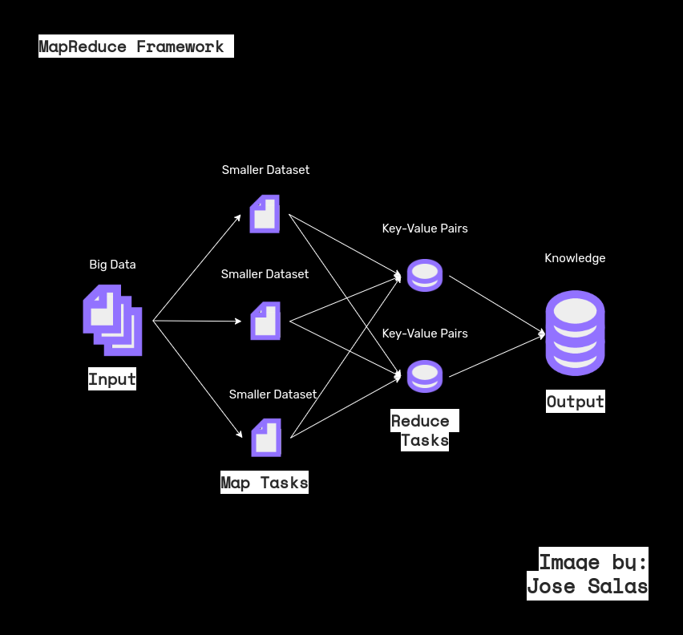

<head>
    <meta http-equiv="Content-Type"content="text/html"charset="utf-8">
    <link href="./css_estilos/estilo_01.css"rel="stylesheet"type="text/css"> 
</head>

 

<body>
    <h1> <b> Mapp Reduce Approach to Stack Overflow Data Management </b> </h1>
</body>

<body>
    <h2> <b> Table of Contents </b> </h2>
</body>

1.  [
 Project Scope Statement (Stack Overflow). 
](#id1)
2.  [
 The Issue. 
](#id2)
3.  [
 Methodological Approach. 
](#id3)
4.  [
 Tools and Technologies. 
](#id4)
5.  [
 Metadata Repository. 
](#id5)
6.  [
 How to Run. 
](#id6)

---

 

<body>
    <h2> <b> Project Scope Statement (Stack Overflow) </b> </h2>
    

    To access the project statement click here:
    

</body>

[
 Statement 
](da_py_cases.pdf)

[
 To Table of Contents 
 ](#id0)

---

 

<body>
    <h2> <b> The Issue </b> </h2>
    

    To identify business's strengths and weaknesses, <b> Stack Overflow </b> needs to analyze the data recorded by the site over the last few years, through accurate comparisons and measurements. 
     
    Being a voluminous dataset and written in .xml, it requires precise instructions to avoid redundancy in the processes and obtain accurate information on the attributes of interest, split the tasks into multiple processing threads, and save the outputs and logs opportunely.  
     
    <h3> <b> Required Items </b> </h3>
    <ul>
        <li> Top 10 most viewed posts. </li>
        <li> Top 10 words by tag. </li>
        <li> Average response time. </li>
    </ul>
</body>

[
 To Table of Contents 
 ](#id0)

---

 

<body>
    <h2> <b> Methodological Approach </b> </h2>
    

    The map-reduce approach was adopted, based on the following steps:  
    <ol>
            <li> Identify, retrieve and store the attributes of interest, in a dictionary list type data structure with format: [{"key_atribute_1": "value_1"}, {"key_atribute_2": "value_2"}, ..., {"key_atribute_n": "value_n"}].  
 </li>
            <li> Sort the list in ascending order.  
 </li>
            <li> Calculate the required items.
            
 </li>
            <li> Print the outputs/logs in .txt files (the outputs and the log file can be found in the "files" folder in this directory). 
 </li>
    </ol>  
    

</body>

[
 To Table of Contents 
 ](#id0)

---

 

<body>
    <h2> <b> Tools and Technologies </b> </h2>
    

        <ul>
            <li> <b> 
 
            Python Modules and Libraries
            </b>: 
                <ul>
                    <li> Datetime (module). </li>
                    <li> Dateutil (module). </li>
                    <li> Logging (module). </li>
                    <li> Lxml. </li>
                    <li> Operator (module). </li>
                    <li> Os (module). </li>
                    <li> Pathlib (module). </li>
                    <li> Pytest (module). </li>
                    <li> Re (module). </li>
                    <li> Statistics (module). </li>
                    <li> Xml (module). </li>
                </ul>
            
 </li>
        </ul>
    

</body>

<body>
    

    The libraries used can be found at .txt file:
     
    

</body>

[
 Requirements 
 ](requirements.txt)

[
 To Table of Contents 
 ](#id0)

---

 

<body>
    <h2> <b> Metadata Repository </b> </h2>
    

    To access metadata repository click here:
    

</body>

[
 Metadata Repository 
](metadata_repository.txt)

[
 To Table of Contents 
 ](#id0)

---

 

<body>
    <h2> <b> How to Run Main Program </b> </h2>
    

    Open the working directory and from the main folder:
    <ol>
        <li> 
 Open the command terminal. 
 </li>
        <li> 
 Access the main folder of the working directory. 
 </li>
        <li> 
 Call the Python interpreter. 
 </li> 
        <li> 
 Execute the following command `core/main.py.` 
 </li>
    </ol>
    

    <h2> <b> How to Run the Unit Tests </b> </h2>
    

    Open the working directory and from the main folder:
    <ol>
        <li> 
 Open the command terminal. 
 </li>
        <li> 
 Access the main folder of the working directory. 
 </li>
        <li> 
 Call the Python interpreter. 
 </li> 
        <li> 
 Execute the following command `pytest core/test_main.py.` 
 </li>
    </ol>
    

</body>

[
 To Table of Contents 
 ](#id0)
